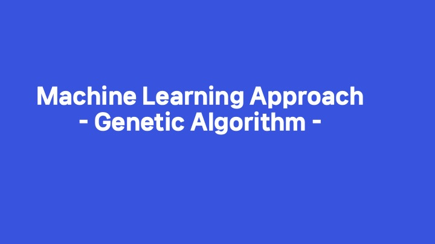
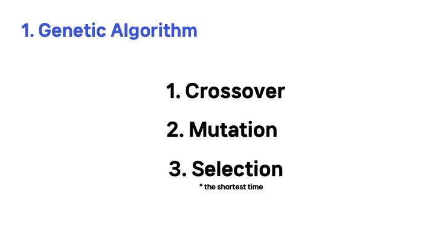
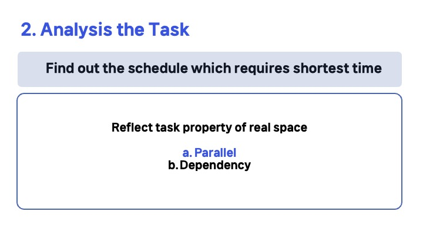
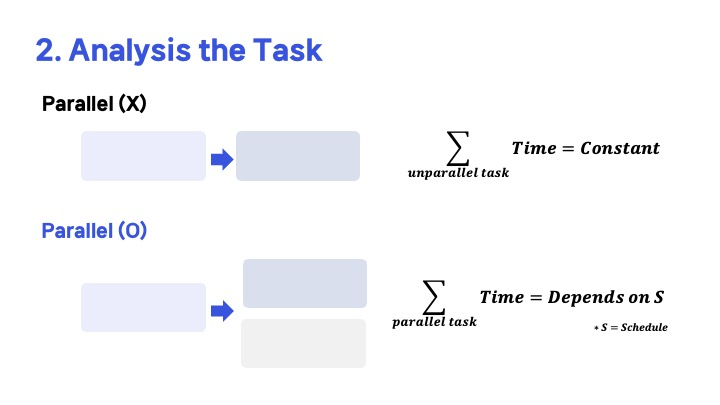
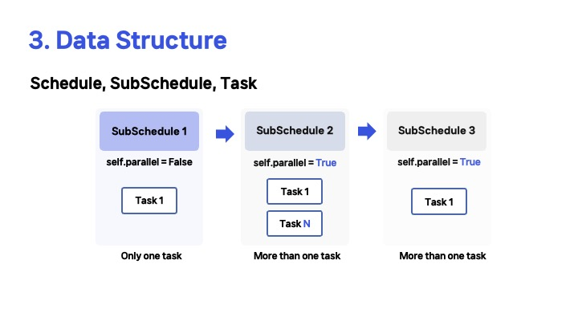
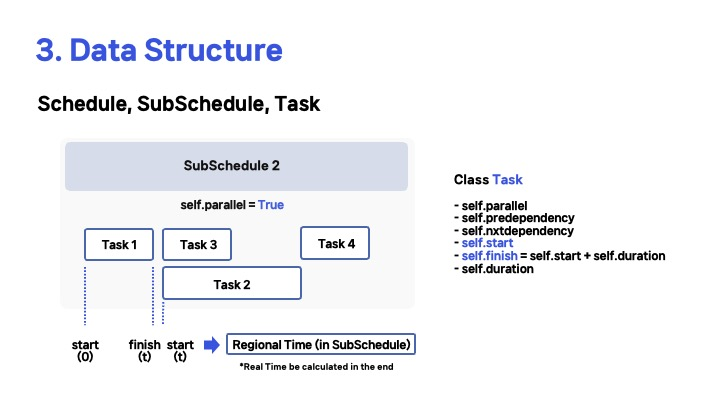
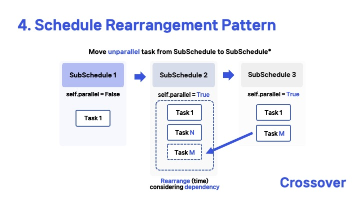
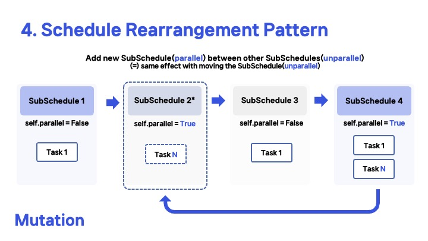

# Genetic-Algorithm-for-Resource-Multi-Tasking
2024 Spring Semester, KENTECH | Algorithm

## Mechanics
- Data Structure
- Implemetation of Crossover, Mutation and Selection

 

 | 
--- | --- |

 | 
--- | --- |

 | 
--- | --- |

 | 
--- | --- |
